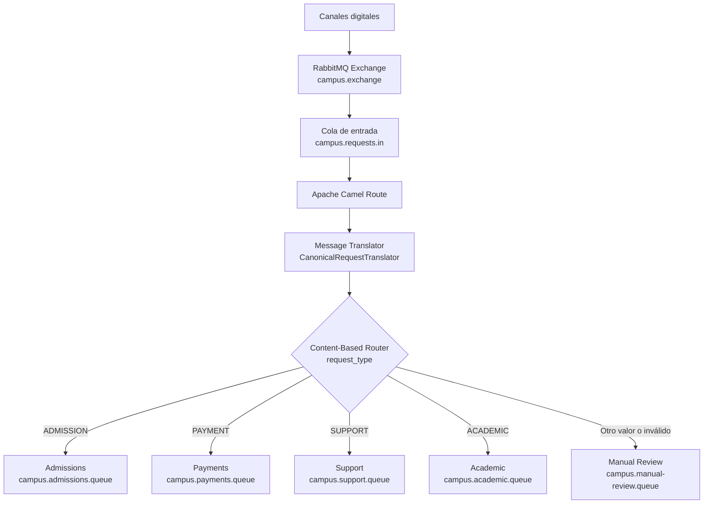

# Smart Campus Request Router

## Message Routing y Message Transformation con RabbitMQ y Apache Camel


## 1. Portada

**Título:** Smart Campus Request Router

**Subtítulo:** Message Routing y Message Transformation con RabbitMQ y Apache Camel

El proyecto implementa una solución de integración basada en mensajería para recibir, transformar y enrutar solicitudes estudiantiles dentro de una institución educativa. La solución usa Spring Boot 3.3.5, Apache Camel 4.8.1, RabbitMQ, Docker, Java 17 y Maven.

---

## 2. Descripción del problema

Una institución educativa recibe solicitudes estudiantiles desde distintos canales digitales. Estas solicitudes pueden pertenecer a procesos de admisión, pagos, soporte, gestión académica u otros casos que requieren revisión manual.

El problema principal consiste en que todas las solicitudes llegan al sistema con un formato de entrada común, pero deben ser clasificadas y enviadas al área correspondiente. Si cada canal digital conociera directamente todas las colas internas, el sistema quedaría fuertemente acoplado a la estructura de mensajería de la institución.

Para resolver este problema, todas las solicitudes llegan inicialmente a la cola:

```text
campus.requests.in
```

Desde esta cola, Apache Camel consume cada mensaje, lo transforma a un modelo canónico mediante un **Message Translator** y posteriormente lo enruta mediante un **Content-Based Router** hacia la cola destino correspondiente.

---

## 3. Objetivos

### Objetivo general

Implementar una solución de integración con Apache Camel y RabbitMQ que permita recibir solicitudes estudiantiles, transformarlas a un modelo canónico y enrutarlas hacia colas especializadas según el contenido del mensaje.

### Objetivos específicos

- Configurar RabbitMQ mediante Docker Compose para disponer de un broker de mensajería local.
- Crear un exchange directo, una cola de entrada y colas destino para las áreas funcionales.
- Implementar una ruta Apache Camel compatible con Camel 4.8.1.
- Transformar los mensajes entrantes a un modelo canónico uniforme.
- Enrutar mensajes según el valor del campo `request_type`.
- Enviar solicitudes no reconocidas o inválidas a una cola de revisión manual.
- Automatizar la configuración de RabbitMQ mediante scripts PowerShell.
- Validar que el proyecto compile y ejecute correctamente con Maven.

---

## 4. Arquitectura de la solución



La arquitectura usa RabbitMQ como broker de mensajería y Apache Camel como motor de integración. El exchange `campus.exchange` recibe mensajes y los entrega inicialmente a `campus.requests.in`. La aplicación Spring Boot consume esa cola, transforma el mensaje y lo publica nuevamente en el mismo exchange usando la routing key de la cola destino.

---

## 5. Tecnologías utilizadas

| Tecnología | Versión | Propósito |
| ---------- | ------- | --------- |
| Java | 17 | Lenguaje y plataforma de ejecución del proyecto. |
| Spring Boot | 3.3.5 | Arranque, configuración y contenedor de la aplicación. |
| Apache Camel | 4.8.1 | Implementación de la ruta de integración, transformación y enrutamiento. |
| RabbitMQ | Imagen `rabbitmq:3-management` | Broker de mensajería AMQP y consola de administración. |
| Docker | Docker Compose | Ejecución local de RabbitMQ. |
| Maven | Proyecto Maven | Gestión de dependencias, compilación y ejecución. |

---

## 6. Estructura del proyecto

```text
smart-campus-request-router/
├── docker-compose.yml
├── pom.xml
├── README.md
├── scripts/
│   ├── publish-messages.ps1
│   └── setup-rabbitmq.ps1
└── src/
    └── main/
        ├── java/
        │   └── ec/
        │       └── udla/
        │           └── integracion/
        │               └── campus/
        │                   ├── CampusRequestRoute.java
        │                   ├── CanonicalRequestTranslator.java
        │                   └── SmartCampusApplication.java
        └── resources/
            └── application.properties
```

Archivos principales:

- `pom.xml`: define Spring Boot 3.3.5, Camel 4.8.1 y las dependencias necesarias.
- `docker-compose.yml`: levanta RabbitMQ con consola de administración.
- `application.properties`: configura el nombre de la aplicación, Camel y la conexión Spring RabbitMQ.
- `CampusRequestRoute.java`: contiene la ruta Camel, el consumo desde RabbitMQ y el enrutamiento.
- `CanonicalRequestTranslator.java`: transforma y valida los mensajes.
- `setup-rabbitmq.ps1`: crea exchange, colas y bindings.
- `publish-messages.ps1`: publica mensajes de prueba.

---

## 7. Configuración de RabbitMQ

RabbitMQ se ejecuta localmente mediante Docker Compose:

```powershell
docker compose up -d
```

La consola de administración queda disponible en:

```text
http://localhost:15672
```

Credenciales:

```text
Usuario: guest
Clave: guest
```

### Exchange

```text
campus.exchange
```

### Tipo

```text
direct
```

### Colas

```text
campus.requests.in
campus.admissions.queue
campus.payments.queue
campus.support.queue
campus.academic.queue
campus.manual-review.queue
```

Cada cola se enlaza al exchange `campus.exchange` con una routing key igual al nombre de la cola. Esto permite que Camel publique mensajes hacia la cola destino usando directamente la routing key correspondiente.

---

## 8. Configuración automática

La configuración de RabbitMQ se automatiza con:

```powershell
powershell -ExecutionPolicy Bypass -File scripts\setup-rabbitmq.ps1
```

El script realiza las siguientes acciones:

- Espera hasta que RabbitMQ Management API esté disponible en `http://localhost:15672/api`.
- Crea el exchange `campus.exchange` de tipo `direct`.
- Crea la cola de entrada `campus.requests.in`.
- Crea las colas destino:
  - `campus.admissions.queue`
  - `campus.payments.queue`
  - `campus.support.queue`
  - `campus.academic.queue`
  - `campus.manual-review.queue`
- Crea los bindings entre `campus.exchange` y cada cola.

El script usa `Invoke-RestMethod` contra la API HTTP de administración de RabbitMQ y el parámetro `-DisableKeepAlive` para evitar problemas de conexión persistente en Windows PowerShell.

---

## 9. Ejecución de la aplicación

Compilar el proyecto:

```powershell
mvn clean package
```

Ejecutar la aplicación:

```powershell
mvn spring-boot:run
```

Durante el arranque ocurre lo siguiente:

- Spring Boot inicia la aplicación `SmartCampusApplication`.
- Spring Boot configura la conexión RabbitMQ usando `spring.rabbitmq.*`.
- Apache Camel inicializa el componente `spring-rabbitmq`.
- Camel detecta el `ConnectionFactory` y el `AmqpAdmin` de Spring RabbitMQ.
- Se crea la ruta `smart-campus-request-router`.
- La aplicación comienza a consumir mensajes desde `campus.requests.in`.

La ruta usa la URI:

```text
spring-rabbitmq:campus.exchange?queues=campus.requests.in&routingKey=campus.requests.in&exchangeType=direct&autoDeclare=false
```

La opción `autoDeclare=false` no impide la ejecución porque los recursos de RabbitMQ son creados previamente por `setup-rabbitmq.ps1`.

---

## 10. Publicación de mensajes

Para publicar mensajes de prueba se utiliza:

```powershell
powershell -ExecutionPolicy Bypass -File scripts\publish-messages.ps1
```

El script publica mensajes en el exchange:

```text
campus.exchange
```

con la routing key:

```text
campus.requests.in
```

Mensajes publicados:

- `ADMISSION`
- `PAYMENT`
- `SUPPORT`
- `ACADEMIC`
- `LIBRARY`
- `INVÁLIDO`

El mensaje `LIBRARY` representa un tipo no reconocido por la ruta. El mensaje inválido representa una solicitud incompleta, sin todos los campos obligatorios requeridos por el traductor.

---

## 11. Reglas de enrutamiento

| `request_type` | Cola destino |
| -------------- | ------------ |
| `ADMISSION` | `campus.admissions.queue` |
| `PAYMENT` | `campus.payments.queue` |
| `SUPPORT` | `campus.support.queue` |
| `ACADEMIC` | `campus.academic.queue` |
| Otro valor | `campus.manual-review.queue` |
| INVÁLIDO | `campus.manual-review.queue` |

La regla de enrutamiento se implementa en `CampusRequestRoute.java` mediante una estructura `choice()` de Apache Camel.

---

## 12. Message Translator

El patrón **Message Translator** resuelve el problema de incompatibilidad entre formatos de datos. Los productores pueden enviar solicitudes usando un formato de entrada, mientras que los consumidores internos reciben una estructura uniforme y estable.

En este proyecto, el traductor está implementado en:

```text
src/main/java/ec/udla/integracion/campus/CanonicalRequestTranslator.java
```

### Transformaciones realizadas

| Campo de entrada | Campo canónico |
| ---------------- | -------------- |
| `request_id` | `requestId` |
| `student_name` | `student.fullName` |
| `student_document` | `student.document` |
| `request_type` | `type` |
| `channel` | `sourceChannel` |
| `created_at` | `createdAt` |

### JSON antes de la transformación

```json
{
  "request_id": "REQ-1001",
  "student_name": "Ana Perez",
  "student_document": "1712345678",
  "request_type": "ADMISSION",
  "channel": "web",
  "created_at": "2026-06-10T10:30:00"
}
```

### JSON después de la transformación

```json
{
  "requestId": "REQ-1001",
  "student": {
    "fullName": "Ana Perez",
    "document": "1712345678"
  },
  "type": "ADMISSION",
  "sourceChannel": "web",
  "createdAt": "2026-06-10T10:30:00"
}
```

El traductor también valida que los campos obligatorios existan, sean de tipo texto y no estén vacíos. Si el mensaje es inválido, se genera un mensaje con estado `INVALID`.

---

## 13. Content-Based Router

El patrón **Content-Based Router** resuelve el problema de decidir el destino de un mensaje a partir de su contenido. En este proyecto, la decisión se basa en el valor de `request_type`, almacenado como propiedad de intercambio en Camel.

### Funcionamiento

1. Camel consume un mensaje desde `campus.requests.in`.
2. El mensaje pasa por `CanonicalRequestTranslator`.
3. El traductor establece la propiedad `requestType`.
4. La ruta evalúa `requestType`.
5. Camel envía el mensaje a la cola correspondiente.
6. Si el tipo no es reconocido o el mensaje es inválido, se envía a revisión manual.

### Ventajas

- Centraliza la lógica de enrutamiento.
- Evita que los productores conozcan las colas internas.
- Permite agregar nuevas reglas sin modificar los canales de origen.
- Reduce el acoplamiento entre productores y consumidores.
- Mejora la trazabilidad mediante logs de decisión.

### Pseudocódigo

```text
recibir mensaje desde campus.requests.in
transformar mensaje a modelo canónico
leer requestType

si requestType == ADMISSION:
    enviar a campus.admissions.queue
si requestType == PAYMENT:
    enviar a campus.payments.queue
si requestType == SUPPORT:
    enviar a campus.support.queue
si requestType == ACADEMIC:
    enviar a campus.academic.queue
en cualquier otro caso:
    enviar a campus.manual-review.queue
```

---

## 14. Modelo Canónico

Un modelo canónico es una representación común de datos que se usa dentro de una arquitectura de integración para desacoplar a los productores de los consumidores.

En este proyecto, el modelo canónico reduce el acoplamiento porque las colas destino no dependen directamente del formato original publicado por los canales digitales. Si el formato de entrada cambia, la modificación principal se concentra en el traductor y no en todas las áreas consumidoras.

### Beneficios

- Establece una estructura uniforme para los mensajes internos.
- Reduce la duplicación de transformaciones.
- Facilita la evolución de los canales de entrada.
- Mejora la mantenibilidad de las rutas de integración.
- Permite que los consumidores procesen mensajes con una estructura predecible.

### JSON canónico

```json
{
  "requestId": "REQ-1001",
  "student": {
    "fullName": "Ana Perez",
    "document": "1712345678"
  },
  "type": "ADMISSION",
  "sourceChannel": "web",
  "createdAt": "2026-06-10T10:30:00"
}
```

---

## 15. Evidencias de ejecución

- [x] RabbitMQ ejecutándose
- [x] Exchange creado
- [x] Colas creadas
- [x] Bindings creados
- [x] BUILD SUCCESS
- [x] Logs Camel
- [x] ADMISSION procesado
- [x] PAYMENT procesado
- [x] SUPPORT procesado
- [x] ACADEMIC procesado
- [x] LIBRARY enviado a manual-review
- [x] Mensaje inválido enviado a manual-review

Evidencias observadas durante la ejecución:

- RabbitMQ expuso los puertos `5672` y `15672`.
- `mvn clean package` finalizó con `BUILD SUCCESS`.
- `mvn spring-boot:run` inició Spring Boot 3.3.5 y Apache Camel 4.8.1.
- Camel inició la ruta `smart-campus-request-router`.
- Camel consumió mensajes desde `campus.requests.in`.
- Los mensajes válidos fueron transformados a formato canónico.
- Los mensajes no reconocidos o inválidos fueron enviados a `campus.manual-review.queue`.

---

## 16. Problemas encontrados y solución

| Problema real encontrado | Causa | Solución aplicada |
| ------------------------ | ----- | ----------------- |
| Dependencia `camel-rabbitmq-starter` incompatible | El BOM de Camel Spring Boot 4.8.1 no gestiona esa dependencia para este uso. Maven fallaba por versión faltante. | Se reemplazó por `camel-spring-rabbitmq-starter`. |
| Migración a `camel-spring-rabbitmq-starter` | Camel 4 con Spring Boot debe usar el componente `spring-rabbitmq` para integrarse con Spring AMQP. | Se cambiaron las URIs de `rabbitmq:` a `spring-rabbitmq:`. |
| Configuración de Spring RabbitMQ | La configuración anterior usaba propiedades del componente `rabbitmq`, no de Spring RabbitMQ. | Se configuró `spring.rabbitmq.host`, `spring.rabbitmq.port`, `spring.rabbitmq.username` y `spring.rabbitmq.password`. |
| Falta de `ConnectionFactory` y `ObjectMapper` | Faltaban starters de Spring Boot para AMQP y JSON. | Se agregaron `spring-boot-starter-amqp` y `spring-boot-starter-json`. |
| Espera de RabbitMQ Management API | El script podía ejecutarse antes de que la API de administración estuviera lista. | Se agregó un ciclo de espera contra `/api/overview`. |
| Corrección de PowerShell KeepAlive | En Windows PowerShell no es correcto forzar `Connection: close` mediante `-Headers`. | Se reemplazó por `-DisableKeepAlive`. |
| Compilación Maven | El proyecto no completaba `mvn clean package` por dependencias incorrectas. | Se corrigió el POM y se validó `BUILD SUCCESS`. |

---

## 17. Preguntas de reflexión obligatorias

### 1. ¿Qué problema resuelve Message Translator?

El patrón Message Translator resuelve el problema de incompatibilidad entre formatos de mensajes. En una institución educativa, distintos canales pueden enviar datos con nombres de campos, estructuras o convenciones distintas. Si los consumidores internos dependieran directamente de esos formatos, cualquier cambio en un canal afectaría a varias partes del sistema. En este proyecto, el traductor convierte el mensaje de entrada a un modelo canónico, permitiendo que las áreas internas reciban una estructura estable.

### 2. ¿Qué problema resuelve Content-Based Router?

El patrón Content-Based Router resuelve el problema de seleccionar dinámicamente el destino de un mensaje de acuerdo con su contenido. En este caso, no todos los mensajes deben ir al mismo proceso institucional. Una solicitud de admisión debe ir a una cola distinta a una solicitud de pago o soporte. El router evalúa `request_type` y decide la cola destino sin exigir que el productor conozca la topología interna de RabbitMQ.

### 3. ¿Por qué primero se transforma y luego se enruta?

Primero se transforma porque el enrutamiento debe operar sobre información normalizada y validada. Si la ruta tomara decisiones directamente sobre mensajes sin validar, podría clasificar incorrectamente mensajes incompletos o mal formados. Al aplicar primero el Message Translator, se garantiza que el campo usado para enrutar sea extraído, validado y colocado en una propiedad de intercambio. Esto mejora la confiabilidad de la decisión de enrutamiento.

### 4. ¿Qué pasaría si cada productor conociera todas las colas?

Si cada productor conociera todas las colas, el sistema tendría alto acoplamiento. Cualquier cambio en nombres de colas, reglas de negocio o distribución interna obligaría a modificar a múltiples productores. Además, cada canal debería replicar lógica de decisión, aumentando la probabilidad de inconsistencias. La arquitectura actual evita ese problema concentrando la decisión en Camel y manteniendo a los productores enfocados en publicar solicitudes al punto de entrada común.

### 5. ¿Qué ventaja tiene el modelo canónico?

El modelo canónico proporciona una representación interna uniforme. Su principal ventaja es que reduce el acoplamiento entre formatos externos y consumidores internos. También permite evolucionar los canales de entrada sin cambiar todas las colas destino. En términos académicos, el modelo canónico actúa como una capa de estabilidad semántica dentro de la arquitectura de integración.

### 6. ¿Qué limitaciones tiene esta solución?

La solución actual implementa una validación básica de campos obligatorios, pero no incluye validación de esquema formal. Tampoco implementa reintentos, dead letter queues, métricas avanzadas ni persistencia de auditoría. Además, las reglas de enrutamiento están codificadas en la ruta Java, por lo que agregar nuevos tipos requiere modificar el código. Estas limitaciones son aceptables para el alcance académico del proyecto, pero deberían revisarse en un ambiente productivo.

### 7. ¿Cómo mejorar el manejo de errores?

El manejo de errores podría mejorarse incorporando una política de errores de Camel con `onException`, reintentos controlados, dead letter queues y trazabilidad de fallos. También sería conveniente registrar el motivo técnico del error, conservar el mensaje original y separar errores de validación de errores de infraestructura. En un escenario productivo, una cola de errores permitiría analizar mensajes fallidos sin perder información.

### 8. ¿Cómo soportar SCHOLARSHIP?

Para soportar `SCHOLARSHIP`, se debería crear una cola específica, por ejemplo `campus.scholarship.queue`, crear su binding en RabbitMQ y agregar una nueva condición en la ruta Camel. La modificación lógica sería incluir una regla que evalúe `requestType == SCHOLARSHIP` y publique el mensaje hacia la nueva cola. Esta extensión mantiene el mismo patrón de diseño usado por las demás solicitudes.

### 9. ¿Qué riesgos tiene mover la lógica al productor?

Mover la lógica al productor aumenta el acoplamiento y distribuye reglas de negocio entre múltiples aplicaciones o canales. Esto dificulta la trazabilidad, la auditoría y el mantenimiento. También puede generar inconsistencias si un productor implementa una regla antigua y otro una regla actualizada. Mantener la lógica en Camel permite centralizar la integración y proteger a los productores de la complejidad interna del sistema.

### 10. ¿Cómo se relaciona con una arquitectura orientada a eventos?

La solución se relaciona con una arquitectura orientada a eventos porque los productores publican mensajes que representan hechos o solicitudes relevantes para la institución, y los consumidores los procesan de forma desacoplada. RabbitMQ actúa como intermediario de eventos y Camel implementa la lógica de integración. Aunque el proyecto no implementa un ecosistema completo de eventos, sí demuestra principios fundamentales como desacoplamiento, mensajería asíncrona, enrutamiento y procesamiento basado en contenido.

---

## 18. Valor agregado implementado

- Scripts PowerShell para Windows.
- Espera automática de RabbitMQ Management API antes de crear recursos.
- Validación de campos obligatorios en `CanonicalRequestTranslator`.
- Logging detallado del mensaje recibido, mensaje transformado, tipo detectado y decisión de enrutamiento.
- README técnico ampliado y redactado en español.
- Diagrama Mermaid profesional para documentar la arquitectura.

---

## 19. Conclusiones

1. Apache Camel permite implementar patrones de integración empresarial de forma clara mediante rutas declarativas en Java.
2. RabbitMQ facilita el desacoplamiento entre productores y consumidores al centralizar la entrega de mensajes mediante exchanges, colas y bindings.
3. El uso de un modelo canónico reduce la dependencia entre el formato de entrada y la estructura esperada por los consumidores internos.
4. El patrón Content-Based Router permite centralizar decisiones de negocio asociadas al enrutamiento de solicitudes.
5. La combinación de Spring Boot, Camel y Spring RabbitMQ ofrece una base adecuada para construir flujos de integración mantenibles.
6. La automatización con PowerShell mejora la repetibilidad del ambiente local, especialmente en entornos Windows.
7. Validar campos obligatorios antes del enrutamiento evita que solicitudes incompletas sean procesadas como casos válidos.
8. La cola de revisión manual permite conservar solicitudes no reconocidas o inválidas para análisis posterior.

---

## 20. Bibliografía

Apache Software Foundation. (2024). *Apache Camel Spring RabbitMQ Component*. Apache Camel Documentation. https://camel.apache.org/components/4.8.x/spring-rabbitmq-component.html

Apache Software Foundation. (2024). *Apache Camel Spring Boot*. Apache Camel Documentation. https://camel.apache.org/camel-spring-boot/

RabbitMQ. (2024). *RabbitMQ Documentation*. VMware Tanzu RabbitMQ. https://www.rabbitmq.com/docs

Spring. (2024). *Spring Boot Reference Documentation*. Spring Documentation. https://docs.spring.io/spring-boot/

Hohpe, G., & Woolf, B. (2003). *Enterprise Integration Patterns: Designing, Building, and Deploying Messaging Solutions*. Addison-Wesley.
